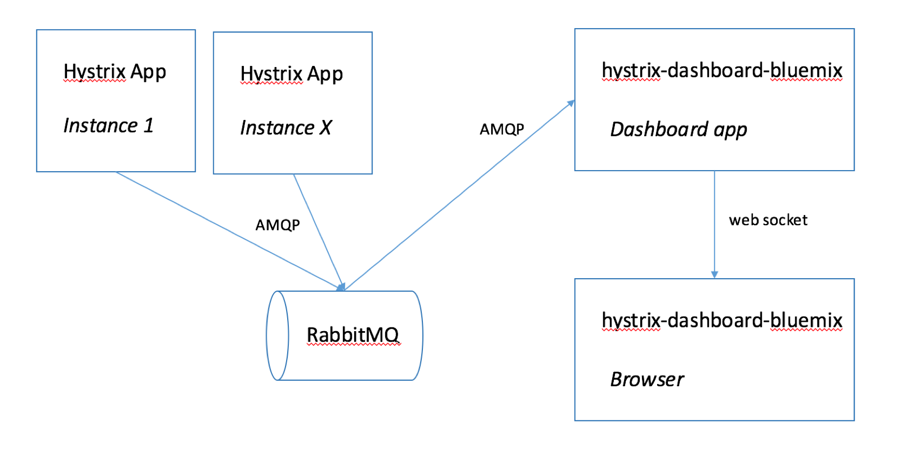

# hystrix-dashboard-bluemix


Sample code for running Netflix Hystrix dashboard on Bluemix Cloud Foundry.
The default dashboard implementation by Netflix uses SSE (Server-Sent Events) protocol to stream Hystric metrics to the dashbard UI which runs in the browser.  SSE does not work with Bluemix, instead the supported protocol for long running connections in Bluemix is web sockets. The sample code provided uses web sockets instead of SSE to communicate with Hystrix dashboard in the browser.  
To allow for metrics aggregation across multiple application instances, standard Turbine AMQP support in Spring Boot for Netflix is used by metrics producer to push all metrics thru same AMQP topic.  You will need to provision an instance of RabbitMQ service in Bluemix and provide connection credentials in application.yml for metrics producer.




To run:
Enable Turbine AMQP in your Spring boot Netflix app e.g. use this sample app


https://github.com/bijukunjummen/sample-spring-turbine-amqp/tree/master/sample-hystrix-app 


Provide your RabbitMQ credentials in application.yml e.g.  


```
hystrix:
  stream:
    queue:
      send-id: false
  command:
    SimpleControlledFailCommand:
      circuitBreaker:
        errorThresholdPercentage: 50
      execution:
        isolation:
          thread:
            timeoutInMilliseconds: 10000

spring:
  rabbitmq:
    host: bluemix-sandbox-dal-9-portal.2.dblayer.com
    port: 15852
    username: admin
    password: xxxx
    virtual-host: bmix_dal_yp_blah-blah-blah
    ssl:
      enabled: true
      algorithm: TLSv1.2
```
Build server-side dashboard code


```
mnv clean install
```
Deploy server-side dashboard code


```
cf push hystix-dashboard -p hystrix-dashboard-amqp-websockets/target/hystrix-dashboard-amqp-websockets-0.0.1.war
```


Run the dashboard


```
http://hystrix-dashboard.mybluemix.net/
```

 


